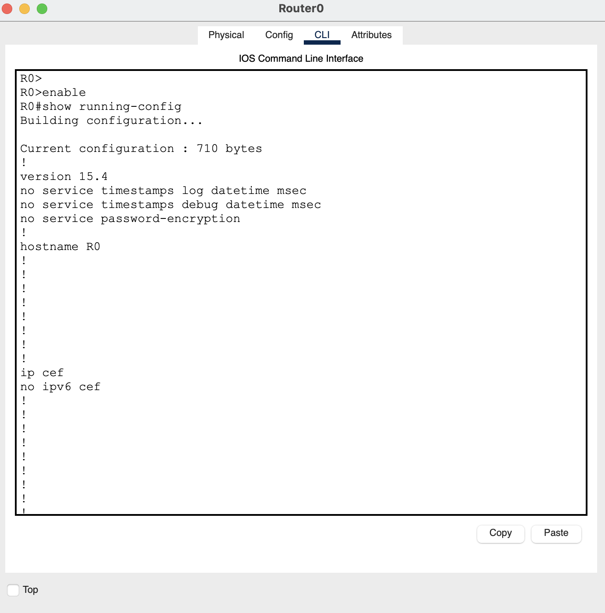
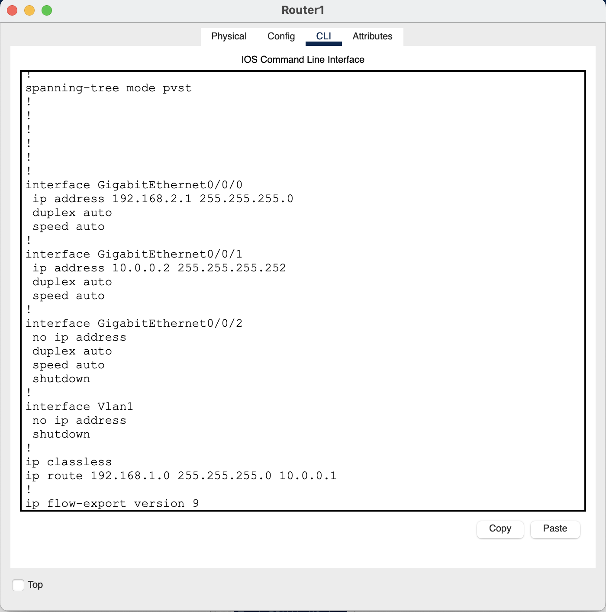

# Cisco Packet Tracer: Basic Static Routing Lab

A foundational Cisco networking lab demonstrating how to establish communication between two isolated Local Area Networks (LANs) using static routing via Cisco IOS.

## Topology Diagram

## Network Architecture & IP Schema
* LAN 1: 192.168.1.0/24
* LAN 2: 192.168.2.0/24
* Inter-Router Link: 10.0.0.0/30
    * Router 0 Interface: 10.0.0.1
    * Router 1 Interface: 10.0.0.2

## Objective & Configuration
The goal was to allow end-devices in LAN 1 to communicate with LAN 2. Since routers only inherently know directly connected routes, static routes were manually added to the routing table.

## Router Configurations

### Router 0 Configuration:

### Router 1 Configuration:

## Verification
* Successful end-to-end ping execution from PC0 to PC2.
* Verified path mapping via tracert.
* Routing table validated utilizing show ip route showing both Connected (C), Local (L), and Static (S) routes.
