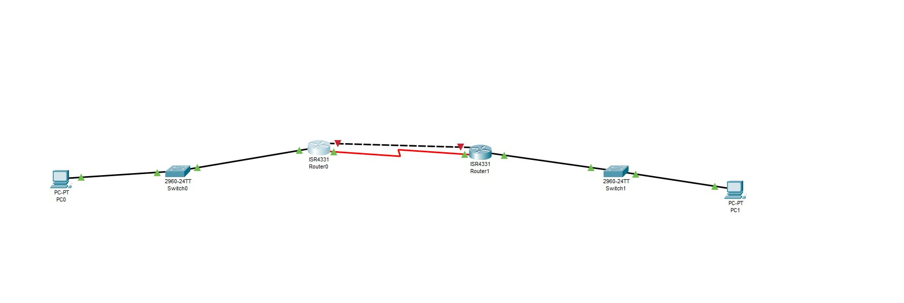

# Floating Static Routing Lab

## Objective

This lab demonstrates how to configure a **floating static route** in Cisco Packet Tracer.

The network uses:

- A primary route with the default Administrative Distance of `1`
- A backup floating static route with Administrative Distance `5`
- Automatic failover when the primary link becomes unavailable

---

## Topology



### Addressing Scheme

| Network | Purpose |
|---|---|
| `192.168.1.0/24` | PC0 LAN |
| `10.0.12.0/30` | Primary link between R0 and R1 |
| `10.0.13.0/30` | Backup link between R0 and R1 |
| `192.168.2.0/24` | PC1 LAN |

### Device IP Addresses

| Device | Interface / Purpose | IP Address |
|---|---|---|
| PC0 | LAN | `192.168.1.10/24` |
| R0 | LAN | `192.168.1.1/24` |
| R0 | Primary link | `10.0.12.1/30` |
| R0 | Backup link | `10.0.13.1/30` |
| R1 | Primary link | `10.0.12.2/30` |
| R1 | Backup link | `10.0.13.2/30` |
| R1 | LAN | `192.168.2.1/24` |
| PC1 | LAN | `192.168.2.10/24` |

PC0 default gateway:

```text
192.168.1.1
